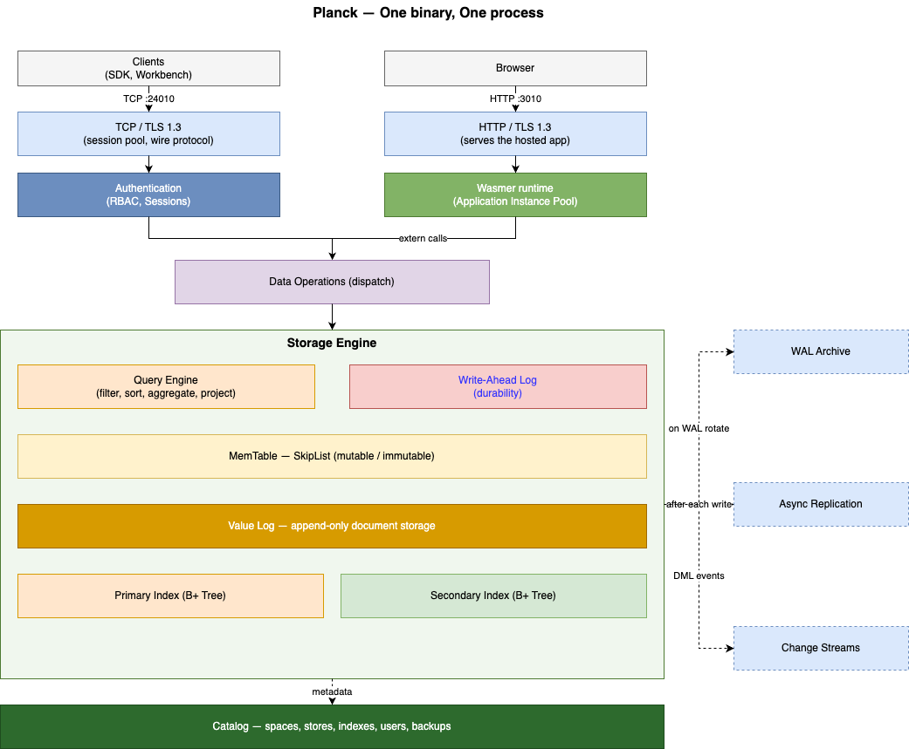

# Planck

Embedded-feel database, network-shaped server. Single Zig binary
(`planck`) that owns:

- An LSM storage engine with WAL durability, primary B+ tree, and
  optional secondary indexes.
- A TCP wire protocol clients talk to (planck-zig-client, planctl,
  workbench).
- An optional HTTP front-end that hosts WASM apps in-process: every
  request runs inside a wasmer instance, and DB operations from the
  app become extern calls rather than network hops.
- Change streams over a `Watch` RPC for consumers that need a tail of
  DML events.
- Replication (primary + replica) over the same wire protocol.

## Architecture

planck is one binary built around a single storage engine, with two
ways in that are _not_ symmetric:

- **TCP wire protocol** (default port 24010): how clients talk to the
  database directly. `planck-zig-client`, `planctl`, and `workbench`
  connect here; a connection enters through a TLS 1.3 session pool and
  passes authentication (RBAC, sessions, throttling) before reaching
  the engine.
- **HTTP** (default port 3010, TLS 1.3): _not_ a database wire
  protocol. It exposes the **WASM app hosted inside planck** over HTTP:
  a browser or HTTP client hits the app, the request runs in the
  in-process WASM runtime (a pooled wasmer instance per request), and
  the app reaches the engine through extern calls, not network hops.

In short: over TCP you query the database directly; over HTTP you call
your app, and the app queries the database in-process.



_Component map of the process (source: [`arch.drawio`](arch.drawio),
editable in draw.io / diagrams.net)._ The two data paths through the
engine, in detail:

**Write path** (`insert` / `update` / `delete` / batch):

1. The op is appended to the **Write-Ahead Log** first, for durability.
   The engine appends to the WAL before it touches the memtable
   ([engine.zig](src/engine/engine.zig)).
2. It is then applied to the **MemTable**, an in-memory SkipList.
3. Right after the memtable write, two async fan-outs fire: **change
   streams** publish the DML event to `Watch` RPC consumers, and **async
   replication** ships the change to the follower.
4. When the MemTable fills (or on the flush interval) it is flushed to
   disk in order: **Value Log** first (the append-only document store),
   then the **Primary Index**, then the **Secondary Indexes**; the
   B+ trees store keys → Value Log locations.
5. Separately, on **WAL rotation** the rotated segment is streamed to the
   **WAL archive**, distinct from the per-write replication in step 3.

**Read path** (`get` / `query` / `scan` / `aggregate`):

1. The **MemTable** is checked first; it holds the most recent writes
   that haven't been flushed yet.
2. On a miss, the relevant **index** (Primary or Secondary B+ tree) is
   consulted to locate the document.
3. The document is fetched from the **Value Log**.
4. The **Query Engine** applies filter / sort / aggregation / projection
   to produce the result.

Below the top layer, both paths share the same engine:

### Memtable

In-memory sorted structure per store. Writes go here first; once it
hits `buffers.memtable` bytes, a background `flush_task` ships its
contents to the vlog and a fresh primary index entry per key.

The memtable holds the most recent version of each key, so reads see
new data before the flush completes. Concurrent flush + read is
handled by frozen-memtable snapshots.

### Value log (vlog)

Append-only segmented file holding the actual BSON document bytes.
Segments are sized via `file_sizes.vlog` (default 1 GiB). New segments
are opened when the active one fills.

Old segments accumulate dead bytes as updates / deletes invalidate
their entries. `gc.dead_ratio` triggers a background GC pass that
copies live entries to a new segment and unlinks the old one. The pass
holds no read locks; readers continue against the old segment until GC
finishes.

### Primary index (B+ tree)

Persistent B+ tree mapping `u128` primary key to a vlog pointer
`(segment_id, offset)`. Disk-resident; in-memory page cache governed
by `cache.capacity`.

Primary keys are 128-bit so a store can carry both an integer id (for
small datasets) and a hash-derived key (when you want UUIDs without
collisions). The client picks; the engine treats it as opaque bytes.

### Secondary indexes

Optional, one B+ tree per indexed field, mapping field value to
primary key. Used by `Query` to avoid full-store scans when the
filter touches an indexed column.

Created via `Create` op with a `DocType.Index` payload. The engine
backfills existing rows in-line, blocks writes to that store while
backfilling (small stores; for big stores you'd add the index before
populating).

### WAL (write-ahead log)

Every write op is appended to a per-host WAL before being applied to
the memtable. A background fsync runs at `flush_interval_in_ms`.
After a crash, recovery replays the WAL into a fresh memtable and
discards entries already flushed to the vlog.

LSN (log sequence number) is monotonically increasing across the
host. Replication uses it as a cursor; the checkpoint header tracks
`last_flushed_lsn` so recovery skips no-op replays.

WAL segments cap at `file_sizes.wal` (default 16 MiB) and rotate.
`log_archive.enabled` ships rotated segments to a directory you
specify, which is what backup tooling consumes.

## Configuration

Two files, both YAML:

- `db.yaml`: storage tuning, TCP wire, durability, replication,
  change streams. Read by the DB itself.
- `service.yaml`: identity, WASM hosting, outbound upstream
  allowlist. Read by the WASM runtime.

Both files are optional; missing files mean safe defaults.

### db.yaml

```yaml
address: "0.0.0.0"
primary: true
max_sessions: 128
port: 24010 # TCP wire port; clients connect here

tls:
  enabled: false # see TLS section below
  cert_file: ""
  key_file: ""

session:
  idle_timeout_ms: 604800000

buffers:
  memtable: 16777216 # 16 MiB before flush
  vlog: 4194304 # 4 MiB write buffer for vlog appends
  wal: 262144 # 256 KiB WAL write buffer

durability:
  enabled: true
  flush_interval_in_ms: 1000 # background WAL flush cadence
  log_archive:
    enabled: false
    dest_path: ""
    retain_logs_days: 15

file_sizes:
  vlog: 1073741824 # 1 GiB per vlog segment
  wal: 16777216 # 16 MiB per WAL segment

index:
  primary:
    pool_size: 64
  secondary:
    pool_size: 64

cache:
  enabled: false # vlog page cache
  capacity: 10000

logging:
  path: "" # empty -> stderr
  level: info # debug | info | warn | err
  max_size_mb: 10
  max_files: 5

gc:
  dead_ratio: 30 # vlog GC trigger %

limits:
  max_batch_size: 10000
  max_message_size: 16777216

security:
  max_failed_attempts: 5
  lockout_duration_ms: 900000
  lockout_multiplier: 2

replica:
  enabled: false
  sync_interval_ms: 5000
  address: "127.0.0.1"
  port: 0

change_streams: # omit the block to disable entirely
  ring_capacity: 16384
  stores:
    - ns: orders
      operations: [insert, update, delete]
```

### service.yaml

```yaml
name: my_app
description: "..."

wasm:
  enabled: true
  min_instances: 2
  max_instances: 8
  autoscale: false
  http:
    host: "127.0.0.1"
    port: 3010 # browser-facing HTTP port for the WASM app
    max_connections: 10000
    max_header_size: 8192
    max_body_size: 1048576
    response_buffer_size: 65536
    idle_timeout_ms: 30000
    max_requests_per_connection: 10000
    drain_timeout_ms: 5000
    static_dir: "../../public" # static assets served from this dir

upstreams: # explicit outbound allowlist
  - name: google_oauth
    url: "https://oauth2.googleapis.com"
    timeout_ms: 10000
    max_in_flight: 8
    breaker:
      failure_threshold: 3
      success_threshold: 1
      open_duration_ms: 30000
```

Outbound calls from WASM code go through `host_call_service`, which
checks the upstream name against this allowlist. There is no general
"reach any URL" path.

## Wire protocol

Clients open a TCP connection to `port` and authenticate with
`uid;key`. Every subsequent message is a `Packet` whose body is an
`Operation` (one of the variants below). Replies come back as packets
of their own.

The protocol is defined in the `proto` crate
([plancksystems/proto](https://github.com/plancksystems/proto)).

Operation tags:

| Tag                                   | Effect                                                |
| ------------------------------------- | ----------------------------------------------------- |
| `Authenticate`                        | uid + key. First op on a new session.                 |
| `Logout`                              | Tear down session.                                    |
| `Insert`                              | Insert one document into a store.                     |
| `BatchInsert`                         | Insert many documents in one round trip.              |
| `Read`                                | Fetch by primary key.                                 |
| `Update`                              | Replace document by primary key.                      |
| `Delete`                              | Remove by primary key.                                |
| `Query`                               | Filter + sort + paginate.                             |
| `Aggregate`                           | count / sum / avg / min / max, with optional groupBy. |
| `Scan`                                | Forward scan starting at a key.                       |
| `Range`                               | Range over a primary-key span.                        |
| `List`                                | List catalog entries (stores, indexes, users).        |
| `NextSequence`                        | Atomic monotonic counter.                             |
| `Watch`                               | Long-poll change stream.                              |
| `Create`                              | DDL: create store, index, user, etc.                  |
| `Drop`                                | DDL: remove a catalog entity.                         |
| `Flush`                               | Force a memtable flush.                               |
| `Reply` / `BatchReply` / `WatchReply` | Server -> client.                                     |

The status enum on replies covers `.ok`, `.err`, `.not_found`,
`.invalid_request`, `.server_error`, `.no_index_on_field`,
`.document_too_large`, and `.not_leader`.

## Change streams

`Watch` is a long-poll RPC: client sends `(stores, since_lsn, max_wait_ms)`,
server holds the call open until a matching event arrives or the
timeout elapses, then replies with all events since `since_lsn`.

Configuration:

```yaml
change_streams:
  ring_capacity: 16384 # events kept for replay across short outages
  stores:
    - ns: orders
      operations: [insert, update, delete]
```

The ring is bounded. If a consumer falls behind by more than
`ring_capacity` events, its next `Watch` returns
`error.CursorBehindRetention` (reported as the `.not_found` reply
status) and it has to bootstrap from a fresh scan. That's the tradeoff: no
disk persistence on the change stream itself, just enough buffer for
typical reconnect windows.

[ssehub](https://github.com/plancksystems/ssehub) is the canonical
consumer: one `WatchClient` fiber per planck DB, fanning out to N
browser EventSources.

## WASM hosting

When `service.wasm.enabled = true`, planck loads
`<base_dir>/wasm/planck.<service_name>.wasm` and instantiates a pool
of wasmer instances. The HTTP server hands each request to a free
instance, calls its `process(req_ptr, req_len)` export, and ships the
response bytes back.

DB operations from inside the WASM module go through the
`host_request` extern: the WASM client serializes a `Packet`, calls
out, and the host runs the same dispatch path the TCP server uses.
There is no socket; the call is a function call with bounded memory
copies in and out.

Why this is fast: no TCP, no kernel buffer, no fiber yield in the hot
path. Why it has a ceiling: wasmer pins each call to one OS thread,
so the only way to scale is more instances in the pool. Default pool
is `min: 2, max: 8`; `autoscale: false` means it stays at min and
only grows under explicit pressure.

The WASM runtime carries its own per-request metrics
(`GET /__wasm_metrics`); see `src/wasm/metrics.zig` for the counter
list.

## Replication

```yaml
replica:
  enabled: true
  sync_interval_ms: 5000
  address: "127.0.0.1"
  port: 24011
```

Primary ships WAL segments to the configured follower address.
Follower applies them in order; reads on the follower see eventually-
consistent state at most `sync_interval_ms` behind.

There's no automatic failover. A follower that becomes a primary is a
deliberate operator action (flip `primary: true` in its config and
restart). The `replica` field in `db.yaml` is for setup; runtime
state surfaces through workbench.

## Security

Every connection authenticates with `uid;key`. The `admin` user is
created at first start with a well-known default key; rotate it with
the `RegenerateKey` op (surfaced through workbench), which clears the
default-key flag.

`security.max_failed_attempts` + `lockout_duration_ms` are per-uid; a
brute-force attempt locks the uid out with exponential backoff
(`lockout_multiplier`). Failed-attempt counters live in the system
catalog so they survive restarts.

User permissions are role-based (admin, read_write, read_only, none).
Per-store ACLs are on the roadmap but not in 0.1.0.

## TLS

`tls.enabled: true` plus a cert and key file makes the TCP wire
TLS 1.3. WASM-hosted apps default to TLS for the HTTP front-end; you
can disable it when planck sits behind a proxy that terminates TLS for
you.

## Backup + Restore

Online backup: `planctl backup --app <name>` snapshots:

1. The current vlog segments + bptree pages (file-level copy of
   `<data_dir>/apps/<name>/data/`).
2. All WAL segments through the current LSN.
3. The catalog dump from the system DB.

Restore: `planctl restore --backup <path>` writes the snapshot back
into the target data dir and starts planck. Recovery replays the
WAL to bring the memtable forward.

Per-store data export / import (JSON / BSON / CSV, manifest-driven)
is exposed over the wire protocol as the `Export` / `Import` control
ops (see `src/exim/`). That's what you use for fixture data and
cross-environment seeding; the file-level backup is for disaster
recovery.

## Operational notes

- **Durability vs throughput**: `flush_interval_in_ms` is the WAL
  fsync cadence. Smaller means tighter "lost on crash" bound, at the
  cost of write throughput. 1000 ms is the default for a reason.
- **Memtable size**: bigger = fewer flushes, larger read-side memory.
  16 MiB is a fine starting point for SMB scale; bump to 64 MiB if
  flushes are visible in your latency histograms.
- **Cache**: off by default. Turn it on for read-heavy workloads
  where the working set is bigger than the OS page cache.
- **GC pressure**: vlog GC runs in the background based on
  `dead_ratio`. If you see write amplification climb, lower the
  threshold; if you see GC churn during peak, raise it.

## License

[Business Source License 1.1](./LICENSE).
